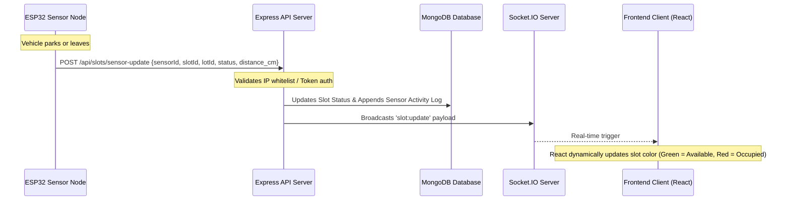
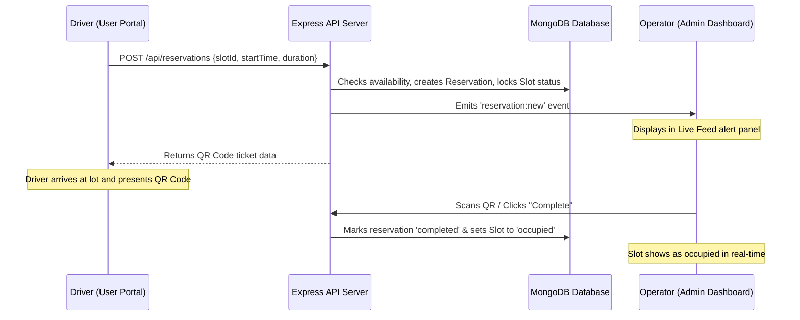
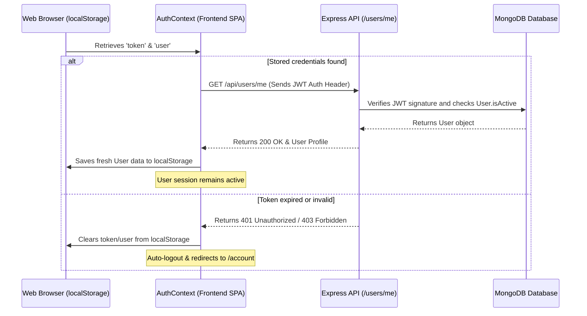

# 🚗 ParkSmart: Complete System Architecture & Operation Guide

Welcome to the official system guide for **ParkSmart**, an IoT-based smart parking management and reservation platform designed specifically for Manaoag, Pangasinan, Philippines.

This document provides a comprehensive technical overview of the system architecture, real-time data flows, IoT integrations, database models, and operational procedures.

---

## 📌 Table of Contents
1. [System Overview](#-system-overview)
2. [High-Level Architecture](#%EF%B8%8F-high-level-architecture)
3. [Core Workflows & Data Flows](#-core-workflows--data-flows)
   - [Real-time IoT Sensor Update Flow](#1-real-time-iot-sensor-update-flow)
   - [Reservation & Ticket Lifecycle](#2-reservation--ticket-lifecycle)
   - [User Session Verification Flow](#3-user-session-verification-flow)
4. [Database Schema Designs](#-database-schema-designs)
5. [IoT Integration Details](#-iot-integration-details)
6. [Real-time Events (WebSockets)](#-real-time-events-websockets)
7. [Installation & Operational Guide](#-installation--operational-guide)

---

## 📖 System Overview

**ParkSmart** addresses urban traffic congestion and parking inefficiencies in high-traffic areas (such as religious landmarks like the Manaoag Church) by combining IoT hardware sensors with a responsive web interface. 

The system serves two main user classes:
1. **Public Drivers (Users)**: Access a web portal to search for nearby parking lots, view real-time slot occupancy, book reservations ahead of time, and manage tickets using QR Codes.
2. **System Administrators & Operators (Admins)**: Utilize a dashboard to monitor live parking lot statuses, track reservation statistics, generate analytical revenue/occupancy reports, view hardware status logs, and manage system configurations.

---

## 🏗️ High-Level Architecture

ParkSmart is built as a decoupled **Client-Server-Database** architecture integrated with **IoT Edge Microcontrollers**.

```
                         ┌───────────────┐
                         │  Web Browser  │ (Public Portal & Admin Dashboard)
                         └───────┬───────┘
                                 │ HTTP requests / WebSockets (Socket.IO)
                                 ▼
                         ┌───────────────┐
                         │  Express API  │ (Backend Application Layer)
                         └───────┬───────┘
                                 │
                 ┌───────────────┴───────────────┐
                 ▼                               ▼
      ┌────────────────────┐          ┌────────────────────┐
      │  MongoDB Database  │          │   ESP32 Sensors    │ (Ultrasonic IoT Nodes)
      └────────────────────┘          └────────────────────┘
```

* **Frontend (Presentation Layer)**: Developed using **React.js (Vite)** and **Tailwind CSS**. It provides a single-page application (SPA) experience. Real-time updates are handled reactively through Socket.IO clients.
* **Backend (Application Layer)**: Powered by **Node.js** and **Express.js**. It exposes secure REST endpoints for resources and manages persistent WebSocket connections.
* **Database (Storage Layer)**: Built on **MongoDB** with **Mongoose ODM**. It houses collections for persistent entities (Users, Lots, Slots, Reservations, Logs).
* **IoT Hardware Layer**: Consists of **ESP32 Microcontrollers** connected to **Ultrasonic Sensors (HC-SR04)** placed at individual parking spots. They report occupancy status to the backend via HTTP POST requests.

---

## 🔄 Core Workflows & Data Flows

### 1. Real-time IoT Sensor Update Flow
The ultrasonic sensor constantly monitors the distance of objects in the parking spot. When a vehicle occupies or vacates a slot, the ESP32 posts the sensor update, which ripples through the system to instantly update the screen of every active driver and operator.



### 2. Reservation & Ticket Lifecycle
Drivers can book a slot in advance. The booking generates a secure ticket with a unique QR Code used for validation upon arrival.



### 3. User Session Verification Flow
To ensure security, user sessions are validated against the backend database upon startup, preventing stale local cache issues (e.g. if the user account is deactivated or the database is reset).



---

## 🗄️ Database Schema Designs

Mongoose schemas organize database records.

### 1. User Collection (`User.js`)
Stores driver, operator, and administrator credentials.
* `name` (String): Full name.
* `email` (String, Unique): Registered email address.
* `phone` (String): Contact phone number.
* `password` (String, Selected: false): Hashed password.
* `role` (String, default: `'user'`): Can be `'user'`, `'lot_operator'`, or `'superadmin'`.
* `isVerified` (Boolean, default: `false`): Email validation flag.
* `isActive` (Boolean, default: `true`): Administrative account toggle.

### 2. ParkingLot Collection (`ParkingLot.js`)
Defines the physical parking facilities.
* `name` (String): Name of the facility (e.g. "Manaoag Church Lot").
* `address` (String): Full physical location.
* `latitude` / `longitude` (Number): Geographic coordinates for Leaflet maps.
* `totalSlots` (Number): Max capacity.
* `ratePerHour` (Number): Cost per hour (PHP).
* `imageUrl` (String): Header image path.

### 3. ParkingSlot Collection (`ParkingSlot.js`)
Represents individual spots inside a lot.
* `lotId` (ObjectId referencing `ParkingLot`): Parent facility.
* `slotName` (String): Spot indicator (e.g., "A1").
* `status` (String): Current status (`'available'`, `'occupied'`, `'reserved'`, `'disabled'`).
* `sensorId` (String, Unique): ID matching the hardware sensor node.
* `currentDistance` (Number): Last reported ultrasonic distance in centimeters.

### 4. Reservation Collection (`Reservation.js`)
Tracks slots booked by drivers.
* `userId` (ObjectId referencing `User`): Booked by.
* `slotId` (ObjectId referencing `ParkingSlot`): Spot reserved.
* `lotId` (ObjectId referencing `ParkingLot`): Location of slot.
* `startTime` (Date): Expected arrival time.
* `endTime` (Date): Expected departure time.
* `totalAmount` (Number): Calculated cost.
* `status` (String): Can be `'pending'`, `'active'`, `'completed'`, or `'cancelled'`.
* `qrCode` (String): String encoded inside the validation ticket QR Code.

---

## 🔌 IoT Integration Details

The hardware layer updates the system via direct HTTP POST calls.

### API Integration Endpoint
* **Endpoint**: `POST http://<api_domain>/api/slots/sensor-update`
* **JSON Request Body**:
```json
{
  "sensorId": "SENSOR_MNC_001",
  "slotId": "667a4e8d2e8b2f0012345678",
  "lotId": "667a4e8c2e8b2f0012345677",
  "status": "occupied",
  "distance_cm": 15
}
```

### Security measures:
1. **IP Whitelisting**: The backend validates requests to the sensor-update endpoint against a comma-separated list of allowed sensor IP addresses defined in the `IOT_IP_WHITELIST` environment variable.
2. **Status Logging**: Every sensor reading is recorded inside a time-series log schema for analytics (viewed via the admin *Sensor Logs* menu).

---

## 📡 Real-time Events (WebSockets)

WebSockets enable instantaneous two-way communications without browser reloading.

| Event Name | Sender | Receiver | Description |
|------------|--------|----------|-------------|
| `slot:update` | Server | Frontend | Triggered when a slot status changes due to a reservation or sensor reading. Refreshes maps and charts. |
| `reservation:new` | Server | Frontend (Admin) | Dispatched upon user checkout. Adds a notification alert in the operator dashboard. |
| `sensor:offline` | Server | Frontend (Admin) | Triggered when a sensor node fails to heartbeat within the timeout window. |

---

## ⚙️ Installation & Operational Guide

### 🚀 Local Quickstart

#### 1. Clone the Codebase
```bash
git clone <repository_url>
cd ParkSmart-WebApp
```

#### 2. Run the MongoDB Database
Ensure your local MongoDB community server is running:
* **Windows**: `net start MongoDB`
* **Mac/Linux**: `brew services start mongodb-community`

#### 3. Setup the Backend
1. Navigate to backend folder:
   ```bash
   cd BACKEND
   ```
2. Create `.env` file from the example template:
   ```bash
   cp .env.example .env
   ```
3. Install dependencies:
   ```bash
   npm install
   ```
4. Run seed data (lots, slots, admin credentials):
   ```bash
   npm run seed
   ```
5. Start development server:
   ```bash
   npm run dev
   ```

#### 4. Setup the Frontend
1. Open a new terminal window and navigate to the frontend folder:
   ```bash
   cd FRONTEND
   ```
2. Install dependencies:
   ```bash
   npm install
   ```
3. Run the Vite development server:
   ```bash
   npm run dev
   ```
4. Open the displayed URL in your browser (typically `http://localhost:5173`).

---
*Created by the ParkSmart Development Team.*
